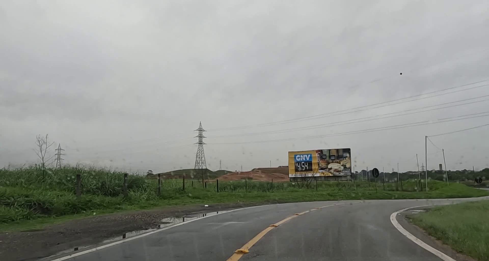
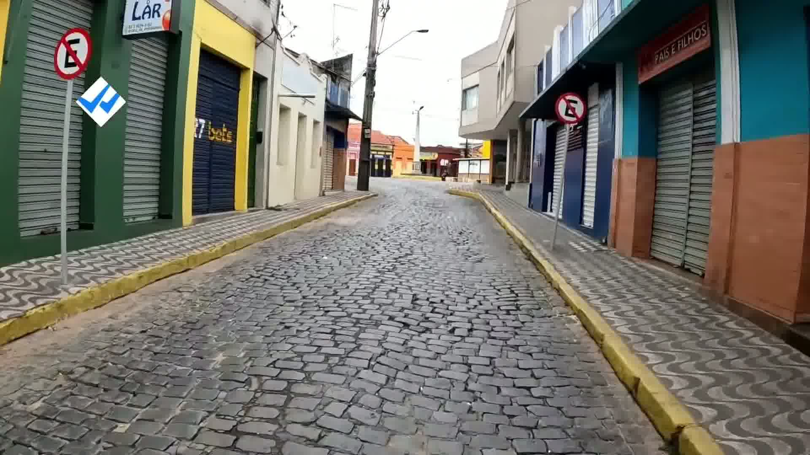
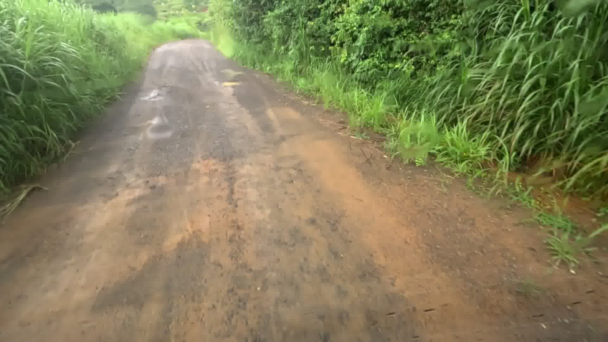

# 🛣️ Classificação de Superfícies de Vias

Este projeto foi desenvolvido como resolução de um desafio para seleção de Iniciação Científica (IC). O objetivo é classificar imagens capturadas por dashcams em três tipos de vias: **Asphalt**, **Belgian Blocks** e **Off-road**.

| Asphalt | Belgian Blocks | Off-road |
|---|---|---|
|  |  |  |

O principal desafio técnico do projeto foi lidar com um dataset altamente desbalanceado (apenas 94 imagens de treino para blocos belgas) e escasso. O projeto demonstra uma progressão de solução, partindo de um baseline arquitetural até chegar a uma abordagem focada nos dados (Data-Centric).

---

## 🧩 O Problema

O dataset apresenta dois desafios centrais:

- **Desbalanceamento severo**: Asphalt (655 imagens), Off-road (151), Belgian Blocks (94)
- **Qualidade visual adversa**: imagens noturnas, sob chuva e com baixa iluminação

Um modelo ingênuo poderia atingir acurácia razoável simplesmente apostando sempre em Asphalt. Por isso, a métrica principal adotada foi o **Macro F1-Score**, que trata todas as classes com igual peso.

---

## 🔬 Experimentos

### Baseline — ResNet-18 + Class Weights
- **Hipótese**: Transfer Learning com pesos por classe é suficiente para lidar com o desbalanceamento
- **Resultado**: Acurácia 90% · Macro F1-Score **0.84**
- **Observação**: Belgian Blocks foi o principal gargalo (F1 = 0.71)

### Experimento 1 — DenseNet-121
- **Hipótese**: Dense Blocks preservam características de textura de baixo nível que ResNet perde nas skip connections por soma
- **Resultado**: Acurácia 94.6% · Macro F1-Score **0.88**
- **Observação**: Melhora significativa, mas recall de Belgian Blocks ainda limitado (0.59)

### Experimento 2 — DenseNet-121 + RandomResizedCrop
- **Hipótese**: O gargalo não é arquitetural, mas representacional. Recortes locais forçam a rede a aprender textura do chão, não atalhos visuais como horizonte ou capô do carro
- **Modificação**: `RandomResizedCrop(224, scale=(0.6, 1.0))` — scale mínimo de 0.6 para garantir que o recorte contenha pista, não apenas céu
- **Resultado**: Acurácia 95% · Macro F1-Score **0.89** ✅ melhor modelo

---

## 📊 Comparativo Final

| Modelo | Acurácia | Macro F1 | F1 Asphalt | F1 Belgian Blocks | F1 Off-road |
|---|---|---|---|---|---|
| ResNet-18 (Baseline) | 90% | 0.84 | 0.95 | 0.71 | 0.85 |
| DenseNet-121 (Exp 1) | 94.6% | 0.88 | 0.98 | 0.73 | 0.93 |
| DenseNet-121 + Crop (Exp 2) | 95% | **0.89** | 0.98 | **0.78** | 0.91 |

---

## 🛠️ Tecnologias

Python · PyTorch · Torchvision · Scikit-learn · Matplotlib · Seaborn · Google Colab

---

## 🚀 Como executar

---

## 📌 Análise crítica

**Onde funciona bem**: Asphalt e Off-road são classificados com alta confiança. Transfer Learning + Class Weights foi eficaz para evitar que o modelo ignorasse as classes minoritárias.

**Onde falha**: Belgian Blocks é o gargalo persistente — blocos lisos confundem com Asphalt, blocos sujos de lama confundem com Off-road.

**Limitação fundamental**: Com apenas 94 imagens de treino para Belgian Blocks, o limite não é algorítmico, é representativo. Mais dados dessa classe teriam mais impacto do que qualquer mudança de arquitetura.

**Próximos passos**: Enriquecimento e melhorias do dataset.